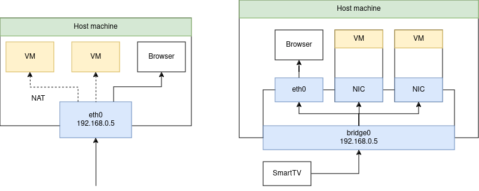

**Create the bridge interface:**
```bash
sudo nmcli connection add type bridge ifname bridge0
```

**Add wired connection (`eth0`) to the bridge:**
```bash
sudo nmcli connection modify eth0 master bridge0
```
**Assign IP configuration to the bridge interface:**
```bash
sudo nmcli connection modify bridge0 ipv4.addresses 192.168.0.5/24
sudo nmcli connection modify bridge0 ipv4.gateway 192.168.0.1
sudo nmcli connection modify bridge0 ipv4.dns "8.8.8.8 8.8.4.4"
sudo nmcli connection modify bridge0 ipv4.method manual
```

**Bring up the bridge and restart the network:**
```bash
sudo nmcli connection up bridge0
sudo nmcli connection down eth0 
sudo nmcli connection up eth0
```

**Verify the bridge:**
```bash
ip addr show bridge0
```
You should see `bridge0` with the IP address `192.168.68.5`.

**Network Flow**

- **Traffic to Host**: When a device on the network sends traffic to `192.168.0.5`, it is received by `bridge0` and processed by the host machine.
- **Traffic to VMs**: When a device on the network sends traffic to `192.168.0.10` (VM1) or `192.168.0.11` (VM2), it goes through `bridge0`, which forwards it to the respective VM.
- **Traffic from VMs**: When VM1 or VM2 sends traffic to the network, it is sent through their vNICs to `bridge0`, which then forwards it through `eno1` to the network.

